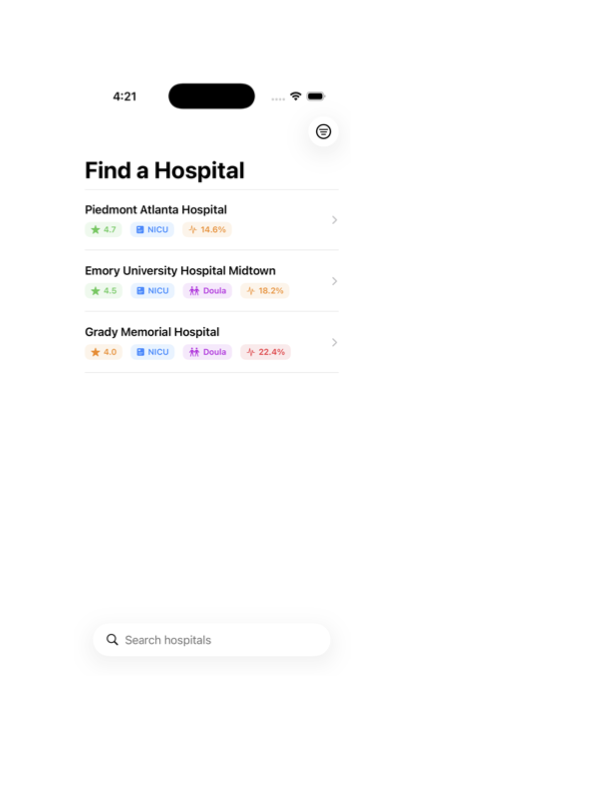
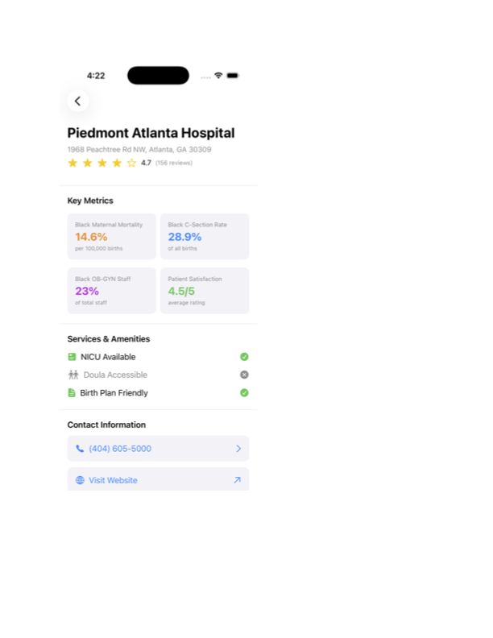
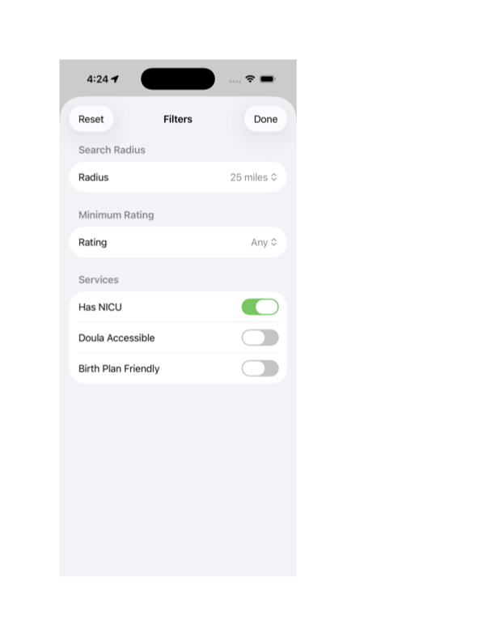

# Maternal Health Equity App

An iOS app concept aimed at helping Black expectant mothers choose a hospital with strong outcomes and culturally competent care, using race-stratified maternal health data — addressing the disparity in Black maternal mortality rates in the U.S.

## Status: Working end-to-end (early data, early features)

The full stack is connected and working: SwiftUI app → REST API (Node/Express) → PostgreSQL database, live. This is a personal project built to learn iOS development end-to-end (Swift, SwiftUI, REST APIs, PostgreSQL) while addressing a real public health problem.

**Current limitation:** only 3 hospitals are seeded, all in Atlanta, GA — the app currently returns every hospital in the database regardless of the user's location, since the backend doesn't yet filter by distance (see Known Gaps below).

## Tech Stack

**iOS App**
- Swift, SwiftUI
- MVVM architecture (Model / View / ViewModel)
- Combine (async data flow)
- MapKit, Core Location

**Backend**
- Node.js + Express (REST API)
- PostgreSQL

## Project Structure

'''
MaternalHealthApp/
├── ios-app/
│   └── MaternalHealthApp/
│       └── MaternalHealthApp/
│           ├── Models/         # Hospital, Review, User, BirthPlan data structures
│           ├── Services/       # NetworkService (API calls)
│           ├── ViewModels/     # HospitalListViewModel, business logic
│           └── Views/          # SwiftUI screens
├── backend-api/
│   └── src/
│       └── server.js           # Express server
└── docs/                       # Architecture notes, setup guide
'''

## Features

- [x] Hospital list view, connected end-to-end to a live PostgreSQL-backed API
- [x] Hospital detail view (ratings, NICU, doula access, staff diversity)
- [x] Location permission + GPS request (Core Location)
- [x] Real `/api/hospitals` endpoint querying PostgreSQL directly
- [x] Filters UI (radius, rating, services) — not yet wired to the backend query
- [ ] Location-based filtering / distance calculation (backend currently ignores lat/long and returns all hospitals)
- [ ] Real hospital + outcomes data beyond Atlanta, GA (currently 3 seeded sample records)
- [ ] CDC / CMS data integration
- [ ] User accounts, saved hospitals, birth plan builder
- [ ] Reviews and patient-reported experience data

## Known Gaps

- **Geography:** all seeded hospitals are in Atlanta, GA. The API has no location filtering yet — it returns every row regardless of the coordinates the app sends.
- **Data:** 3 hospitals total, manually seeded — not sourced from CDC/CMS yet.

## Running locally

**Backend:**
'''bash
cd backend-api
npm install
node src/server.js
'''
Runs on 'http://localhost:3000'.
- Health check: 'GET /api/health'
- Hospital data: 'GET /api/hospitals'

**Database:**
'''bash
psql maternal_health_dev
'''
Table: 'hospitals' — schema and seed data in 'docs/' (or recreate via the SQL in project notes).

**iOS App:**
Open 'ios-app/MaternalHealthApp/MaternalHealthApp.xcodeproj' in Xcode and run on a simulator. Requires both PostgreSQL and the backend server running locally (see above). Uses 'MockNetworkService' as a fallback for offline UI development — toggle via 'useMockData' in 'HospitalListViewModel'.

## Why this project

Black mothers in the U.S. face maternal mortality rates several times higher than white mothers. Existing hospital-quality tools rarely surface race-stratified outcome data, making it hard for expectant mothers to factor this into where they choose to give birth. This project explores whether surfacing that data directly, alongside self-advocacy resources, could help.

## License

Not yet decided — personal/educational project for now.

## Screenshots

### Home Page

### Ratings Page

### Filters Page

